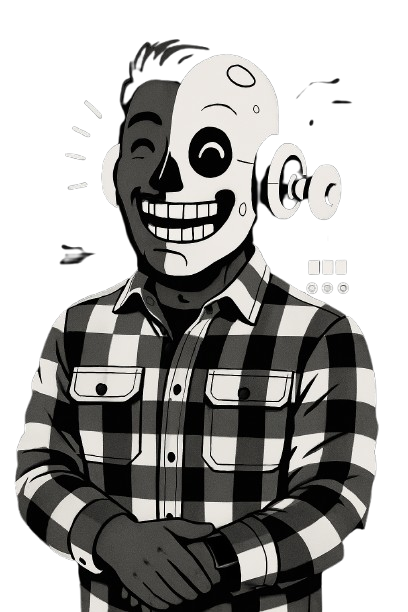

# Arya Teja Rudraraju | Portfolio

A modern, interactive portfolio website built with Next.js 15, React 19, TypeScript, and Tailwind CSS, showcasing AI engineering expertise and professional experience.



## Features

- **Modern Tech Stack**: Next.js 15, React 19, TypeScript, and Tailwind CSS
- **Interactive UI Elements**: 
  - Binary animation that follows cursor movements
  - Typewriter text effect
  - Smooth scroll animations with Framer Motion
  - Responsive design for all devices
- **Dark Theme**: Sleek dark-themed UI with teal accents
- **Performance Optimized**: Server components, image optimization, and efficient animations
- **Sections**:
  - Hero with animated elements
  - Projects showcase
  - About section with flowing card design
  - Blog
  - Command palette for navigation

## Getting Started

First, install the dependencies:

```bash
npm install
# or
yarn install
# or
pnpm install
```

Then, run the development server:

```bash
npm run dev
# or
yarn dev
# or
pnpm dev
```

Open [http://localhost:3000](http://localhost:3000) with your browser to see the result.

## Project Structure

```
portfolio/
├── public/           # Static assets
├── src/
│   ├── app/          # Next.js App Router pages
│   ├── components/   # Reusable UI components
│   ├── fancy/        # Advanced animations and effects
│   ├── hooks/        # Custom React hooks
│   ├── lib/          # Utility functions
│   ├── providers/    # Context providers
│   └── types/        # TypeScript type definitions
```

## Key Components

- **Hero Section**: Showcases name, typewriter effect, and robot image
- **Binary Animation**: Interactive animation that follows cursor movements
- **About Section**: Flowing card design with connecting lines and animations
- **Projects**: Showcase of AI engineering projects
- **Command Palette**: Quick navigation through the site

## Technologies Used

- **Framework**: Next.js 15
- **UI Library**: React 19
- **Styling**: Tailwind CSS 4
- **Animations**: Framer Motion
- **Typography**: Inter, Poppins, and Fira Code fonts
- **Icons**: Phosphor Icons

## Design Philosophy

The portfolio follows a modern, dark-themed design with teal accents (#2dd4bf), focusing on:

- Clean, minimalist UI with purposeful animations
- Responsive design that works on all devices
- Interactive elements that enhance user experience
- Consistent typography and color scheme

## Performance Considerations

- Server components for improved loading performance
- Image optimization with Next.js Image component
- Efficient animations with cleanup to prevent memory leaks
- Client-side components wrapped in ClientOnly to prevent hydration issues

## License

This project is licensed under the MIT License - see the LICENSE file for details.

## Contact

Arya Teja Rudraraju - [LinkedIn](https://linkedin.com/in/arya-teja-rudraraju) - admin@aryateja.com

Arya Teja Rudraraju - [LinkedIn](https://linkedin.com/in/arya-teja-rudraraju) - [X/Twitter](https://x.com/r_aryateja) - admin@aryateja.com
